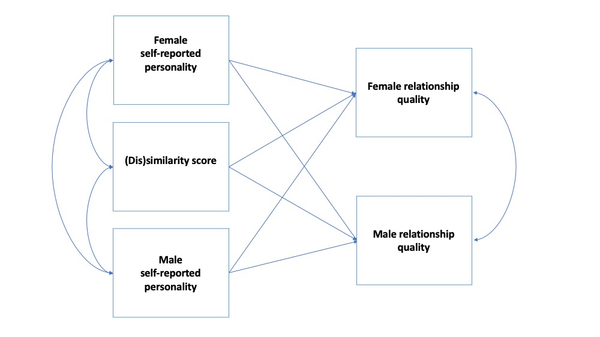

```{r setup, include=FALSE}
knitr::opts_chunk$set(echo = TRUE)
```

```{r libraries, warning=FALSE, message=FALSE}
library(dplyr)       # general wrangling
library(tidyr)       # pivot_wider
library(Hmisc)       # correlation matrix
library(psych)       # fisher's z transformation
library(lme4)        # linear mixed model   
library(lmerTest)    # linear mixed model significance test
library(lavaan)      # RI-CLPM
library(semPlot)     # semPaths
library(kableExtra)  # for styling and scroll_box

# source the helper file
source("00_helpers.R")
```

This preregistration document is published on [Rpubs](https://rpubs.com/nguyenllpsych/diss-03-prereg).

# Simulated Data

For the preregistration, we are simulating purely random data with 3 waves of 60 couples X 2 = 120 participants to mimic the shorter design of study one. We will simulate a few variables:

- `satis`: Dyadic satisfaction with is a relationship outcome variable
- `open`, `consci`, `extra`, `agree` `neuro`: Big Five personality traits
- `care_self` and `care_partner`: Caregiving sensitivity answered about one's self and one's partner.

**Important**: Our dyads are distinguishable because both studies have only heterosexual couples for which one member is male and the other is female. Data for female participants are under columns with the suffix `_1` and data for male participants are `_2`

```{r dat}
# set seed
set.seed(202309)

# simulate long dataset
long_dat <- data.frame(
  couple = rep(1:60, each = 2*3),
  partner = rep(c(1,1,1,2,2,2)),
  time   = rep(1:3),
  satis  = rnorm(n = 120*3, mean = 43, sd = 4),
  open   = rnorm(n = 120*3, mean = 3.4, sd = 0.6),
  consci = rnorm(n = 120*3, mean = 3.8, sd = 0.6),
  extra  = rnorm(n = 120*3, mean = 3.3, sd = 0.9),
  agree  = rnorm(n = 120*3, mean = 3.8, sd = 0.6),
  neuro  = rnorm(n = 120*3, mean = 2.5, sd = 0.7),
  care_self    = rnorm(n = 120*3, mean = 5.2, sd = 1),
  care_partner = rnorm(n = 120*3, mean = 5.2, sd = 1)
)

# add random missingness ~ 10%
n_rows <- nrow(long_dat)
n_cols <- which(!names(long_dat) %in% c("couple", "partner", "time"))
row_missing <- matrix(
  sample(1:n_rows, 
         # 10% missingness across all rows and specified columns
         round(10/100 *n_rows*length(n_cols),0)),
  ncol = length(n_cols))
for(col in 1:length(n_cols)) {
  long_dat[row_missing[,col], n_cols[col]] <- NA
}

head(long_dat) %>% 
  knitr::kable(
    caption = "Long data structure: nrow = # participants x # time points"
    ) %>%
  kableExtra::kable_styling()

# simulate wide dataset with side-by-side partners
dat <- long_dat %>%
  pivot_wider(names_from = partner,
              values_from = satis:care_partner)

head(dat) %>% 
  knitr::kable(
    caption = "Wide-ish data structure: nrow = # couples x # time points"
  ) %>% 
  kableExtra::kable_styling() %>%
  scroll_box(height = "300px")
```

# Research Question 1. Evidence of Assortative Mating

## H1. Baseline similarity

#### At baseline, romantic partners are similar in their personality such that their scale scores are significantly and positively correlated

I will examine the bivariate Pearson’s $r$ correlations between dyadic member’s self-reported scale scores at Time 1. Because all dyads are distinguishable (heterosexual couples with one female and one male partner), we are not computing the intraclass correlation but instead rely on $r$. In addition, profile correlations (Humbad et al., 2013) will be computed for the self-reported scale scores of the BFAS in study one and the BFI, CQ, and CPS in study two as an index of multivariate similarity in personality traits, caregiving styles, and conflict strategies. The unit of analysis will be at the dyad level: for each of these scales, a bivariate Pearson’s r correlation is computed between two partners’ score vectors. For each scale, three sets of models will be run with profile correlations calculated by raw, gender-mean-centered, and standardized scores.

```{r H1}
var_list <- c("open", "consci", "extra", "agree", "neuro", 
              "care_self", "care_partner")

prof_list <- data.frame(
  bigfive = c("open", "consci", "extra", "agree", "neuro")
)

h1_results <- h1_function(var_list = var_list, prof_list = prof_list, df = dat)

h1_results$bivariate %>% 
  knitr::kable(caption = "Bivariate between-partner correlation") %>% 
  kableExtra::kable_styling()
h1_results$profile %>% 
  knitr::kable(caption = "Proportion of signficant between-partner profile correlations") %>% kableExtra::kable_styling()

dat <- merge(dat, h1_results$profile_df)
summary(dat %>% select(bigfive_raw_r,
                       bigfive_centered_r,
                       bigfive_std_r)) %>% 
  knitr::kable(caption = "Descriptive summary of profile correlations") %>% 
  kableExtra::kable_styling()
```

## H2. Difference in correlations

#### At baseline, romantic partners are more similar in their characteristic adaptations than in their personality traits.

I will conduct a $z$-difference test using Fisher’s $z$-transformed bivariate correlations calculated in H1 to test the significance of the difference between each trait correlation and each CA correlation. A significant difference is when the two confidence intervals do not overlap. The hypothesis is fully confirmed if all CA correlations are significantly larger than all trait correlations; it is partially confirmed if all CA correlations are significantly larger or statistically equivalent to all trait correlations; it is rejected if at least one CA correlation is significantly smaller than at least one trait correlation. There is no hypothesized difference in similarity among the CAs.
 
$$
z_{\text{difference}} = \frac{z_1 - z_2}{\sqrt{\frac{1}{n_1-3} + \frac{1}{n_2-3}}}
$$

```{r H2}
# run function on simulated data
h2_function(cor_tab = h1_results$bivariate) %>% 
  knitr::kable(caption = "Comparisons of bivariate correlations of personality traits vs CAs") %>% 
  kableExtra::kable_styling() %>%
  scroll_box(height = "300px")
```

## H3. Longitudinal similarity

#### Longitudinally, romantic partners show a similar change trajectory in self-reported personality across the first two years of parenthood such that their slopes are significantly and positively correlated.

I will fit a linear mixed model for each measured personality variable with random intercepts and random slopes at the individual level, with a separate model for each gender. I will extract the fitted slope for each individual and examine the bivariate Pearson’s $r$ correlations between dyadic member’s slopes for each personality variable.

```{r H3}
var_list <- c("open", "consci", "extra", "agree", "neuro", 
              "care_self", "care_partner")

# run function
h3_results <- h3_function(var_list = var_list, df = dat)

# view longitudinal trends
h3_results$slopes_tab %>% 
  knitr::kable(caption = "Longitudinal trends in personality variables") %>% 
  kableExtra::kable_styling() %>%
  scroll_box(height = "300px")

# view longitudinal similarity 
h3_results$cor_tab %>% 
  knitr::kable(caption = "Bivariate between-partner slope correlations") %>% 
  kableExtra::kable_styling() %>%
  scroll_box(height = "300px")

# store slopes for later analyses in main dataframe
dat <- merge(dat, h3_results$slope_df, all.x = TRUE)
```

# Research Question 2. Benefit of Assortative Mating

## H4. Baseline benefit

#### At baseline, partner similarity in self-reported personality is associated with enhanced relationship quality.

I will fit a multiple regression model in which both dyad members’ scores along with an interaction term are used to predict relationship quality. Four separate sets of models will be fit: two sets with female partners’ dyadic satisfaction and cohesion and two sets with male partners’ dyadic satisfaction and cohesion as the dependent variable. Within each set, separate models are run for each measured personality variable. The hypothesis is confirmed if the interaction term is significantly positive for a partial attenuation, in which the main effects may still remain significantly positive after the interaction term is added.
 
Alternatively, I will run a simple linear regression model in which the absolute value of the difference between the female and male partner’s scores on a particular variable is used to predict relationship quality. In addition, for the BFAS in study one and the BFI, CQ, and CPS scales in study two, I will run a simple linear regression model in which the Fisher’s $z$-transformed score of the profile correlations calculated in H1 is used to predict relationship quality. For each scale, three sets of models will be run with profile correlations calculated by raw, gender-mean-centered, and standardized scores. Compared to the interaction test, these regression models are a much simpler and more powered approach to the same conceptual question; however, they present different operationalization of similarity. We consider these alternative approaches to be conceptual robustness checks; the hypothesis is fully confirmed if both approaches meet the significant criteria, partially confirmed if only one approach meets the criteria, and rejected if neither meets the criteria. 

```{r H4}
var_list <- c("open", "consci", "extra", "agree", "neuro", 
              "care_self", "care_partner")

prof_list <- c("bigfive")

quality_list <- c("satis")

# run function
h4_results <- h4_function(var_list = var_list, 
                          quality_list = quality_list, 
                          prof_list = prof_list,
                          df = dat)

h4_results$interaction_tab %>% 
  knitr::kable(
    caption = "Multiple regression results with interaction terms predicting relationship quality"
  ) %>% 
  kableExtra::kable_styling() %>%
  scroll_box(height = "300px")
h4_results$difference_tab %>% 
  knitr::kable(
    caption = "Simple regression results with difference scores predicting relationship quality"
  ) %>% 
  kableExtra::kable_styling() %>%
  scroll_box(height = "300px")
h4_results$profile_tab %>% 
  knitr::kable(
    caption = "Simple regression results with profile correlations predicting relationship quality"
  ) %>% 
  kableExtra::kable_styling()
```

## H5. Baseline benefit with longitudinal predictors

#### Longitudinally, partner similarity in change trajectories of self-reported personality is associated with enhanced relationship quality at baseline.

I will fit a multiple regression model in which both dyad members’ slopes (extracted in H3) along with an interaction term are used to predict relationship quality. Similar to H4, four sets of models will be fit to predict female and male satisfaction and cohesion, and separate models are run for each measured personality variable. The hypothesis is confirmed if the interaction term is significantly positive for a partial attenuation. Because the fitted slopes were extracted using two different methods in H3, models will be run using these two sets of slopes for robustness checks.

Alternatively, I will run a simple linear regression model in which the absolute value of the difference between the female and male partner’s scores on a particular slope is used to predict relationship quality. The hypothesis is fully confirmed if both approaches meet the significant criteria, partially confirmed if only one approach meets the criteria, and rejected if neither meets the criteria. 

```{r H5}
var_list <- c("open", "consci", "extra", "agree", "neuro", 
              "care_self", "care_partner")

quality_list <- c("satis")

# run function
h5_results <- h5_function(var_list = var_list, 
                          quality_list = quality_list, 
                          df = dat) 
h5_results$interaction_tab %>% 
  knitr::kable(
    caption = "Longitudinal predictors: Multiple regression results with interaction terms of predicting relationship quality"
  ) %>% 
  kableExtra::kable_styling() %>%
  scroll_box(height = "300px")
h5_results$difference_tab %>% 
  knitr::kable(
    caption = "Longitudinal predictors: Simple regression results with difference-slope scores predicting relationship quality"
  ) %>% 
  kableExtra::kable_styling() %>%
  scroll_box(height = "300px")
```

## H6. Longitudinal benefit

#### Longitudinally, partner similarity in change trajectories of self-reported personality is associated with an increase in relationship quality

Analyses are similar to H5 with the same predictors, but linear mixed models will be fit for female/male dyadic satisfaction and cohesion, and their individual extracted slopes will be used as the dependent variable instead of relationship quality at baseline. Similar to H5, the hypothesis is fully confirmed if the interaction term is significantly positive for a partial attenuation and if the alternative simple linear regression model with the absolute value of the difference in personality slope as predictors of longitudinal benefits is significant. The hypothesis is partially confirmed if only one approach meets the criteria and rejected if neither meets the criteria.

```{r H6}
var_list <- c("open", "consci", "extra", "agree", "neuro", 
              "care_self", "care_partner")

quality_list <- c("satis")

# run function
h6_results <- h6_function(var_list = var_list, 
                          quality_list = quality_list, 
                          df = dat) 
h6_results$interaction_tab %>% 
  knitr::kable(
    caption = "Longitudinal predictors: Multiple regression results with interaction terms predicting longitudinal relationship quality"
  ) %>% kableExtra::kable_styling() %>%
  scroll_box(height = "300px")
h6_results$difference_tab %>% 
  knitr::kable(
    caption = "Longitudinal predictors: Simple regression results with difference scores predicting longitudinal relationship quality"
  ) %>% kableExtra::kable_styling() %>%
  scroll_box(height = "300px")
```

## H7. Cross-lagged effects

#### Longitudinally, there may be cross-lagged effects such that partner similarity in personality at each time point is associated with relationship quality at a subsequent time point, and vice versa. This is an exploratory analysis with no hypothesized direction.

I will run a random-intercept cross-lagged panel model, following the general structure as depicted in Figure 1. Four separate sets of models will be run, with the variable for relationship quality being female/male satisfaction and cohesion. Within each set, there will be separate models for similarity in each measured personality variable, with similarity operationalized as the reversed discrepancy scores: the absolute value of the difference between the female and male partner’s scores on a particular personality variable.  

In addition to the bivariate discrepancy score, for the BFAS scales in study one and CQ and CPS scales in study two, I will run the same sets of models in which similarity is operationalized as the Fisher’s $z$-transformed score of the profile correlations calculated in H1 at each wave.


```{r H7}
var_list <- c("open", "consci", "extra", "agree", "neuro", 
              "care_self", "care_partner")

prof_list <- c("bigfive")

quality_list <- c("satis")

# run function 
h7_results <- h7_function(var_list = var_list, prof_list = prof_list,
                          quality_list = quality_list, df = dat)
h7_results$fit_df %>%
  knitr::kable(
    caption = "Fit statistics for models of univariate personality difference") %>%
  kableExtra::kable_styling() %>%
  scroll_box(height = "300px")

h7_results$est_df %>%
  knitr::kable(
    caption = "Standardized solutions for models of univariate personality difference") %>%
  kableExtra::kable_styling() %>%
  scroll_box(height = "300px")

h7_results$fitprof_df %>%
  knitr::kable(
    caption = "Fit statistics for models of personality profile correlation") %>%
  kableExtra::kable_styling() %>%
  scroll_box(height = "300px")

h7_results$estprof_df %>%
  knitr::kable(
    caption = "Standardized solutions for models of personality profile correlation") %>%
  kableExtra::kable_styling() %>%
  scroll_box(height = "300px")
```


# Research Question 3. Actor/Partner/Perceived/Similarity

## H8. Actor/partner effect on quality

#### At baseline, self-reported characteristic adaptations are most strongly associated with self-reported relationship quality, more so than the effect of partner-reported and similarity on these variables.

I will run an Actor-Partner Interdependence Model (APIM; Campbell & Kashy, 2002; Cook & Kenny, 2005; Kenny & Ledermann, 2010) following the general structures as depicted in Figures 2. Figure 2 depicts a model for actual similarity, including both partners' self-reported personality scores. The hypothesis is supported if the actor path estimates are larger than the partner and similarity path estimates, using 95% confidence intervals.



```{r H8}
var_list <- c("open", "consci", "extra", "agree", "neuro",
              "care_self", "care_partner")

quality_list <- c("satis")

# run function
h8_results <- h8_function(var_list = var_list,
                          quality_list = quality_list,
                          time = 1, df = dat)
h8_results %>%
  knitr::kable(
    caption = "Standardized solutions for APIM models with actual similarity"
  ) %>%
  kableExtra::kable_styling() %>%
  scroll_box(height = "300px")
```


## H9. Perceived/actual similarity comparison 

#### At baseline, perceived similarity in personality traits and characteristic adaptations is stronger than actual similarity. That is, the correlation between each partner’s self-perception and perception of their partner is stronger than the correlation between two partners’ self-perceptions.

In order to compare the effect size of actual and perceived similarity, I will conduct a z-difference test using Fisher’s $z$-transformed bivariate correlations between (a) self-reports of each partner, (b) female partner's self-perception and perception of male partner, and (c) male partner's self-perception and perception of female partner. The difference between these associations is considered significant if the two 95% confidence intervals do not overlap.

```{r h9}
perception_list <- c("care")

# run function
h9_results <- h9_function(perception_list = perception_list,
                          time = 1, df = dat)

h9_results$similarity_df %>%
  knitr::kable(
    caption = "Actual and perceived similarities as bivariate correlations") %>%
  kableExtra::kable_styling() %>%
  scroll_box(height = "300px")

h9_results$compare_df %>%
  knitr::kable(
    caption = "Comparison between actual and perceived similarities") %>%
  kableExtra::kable_styling() %>%
  scroll_box(height = "300px")
```

## H10. Perceived/actual similarity effects

#### At baseline, each partner’s perceived similarity is more strongly associated with self-reported relationship quality than actual similarity is.

In order to compare the effect sizes of the relationship between actual/perceived similarity and relationship quality, we will run the Actor-Partner Interdependence Models following the general structures as depicted in Figure 3. This structure is similar to Figure 2 of H8, but it depicts a model for *perceived* similarity, including one partner's perception of their own personality and of their partner's personality. There are technically two sets of models for perceived similarity, one using the female partner's perception and one with the male partner's perception. I compare the estimated paths and their standard errors. The difference between these associations is considered significant if the two 95% confidence intervals do not overlap.


```{r h10}
perception_list <- c("care")

quality_list <- c("satis")

# run function
h10_results <- h10_function(perception_list = perception_list,
                            quality_list = quality_list,
                            time = 1, df = dat)

h10_results$est_df_p1 %>%
  knitr::kable(
    caption = "Standardized solutions for APIM models with female-perceived similarity"
  ) %>%
  kableExtra::kable_styling() %>%
  scroll_box(height = "300px")
h10_results$est_df_p2 %>%
  knitr::kable(
    caption = "Standardized solutions for APIM models with male-perceived similarity"
  ) %>%
  kableExtra::kable_styling() %>%
  scroll_box(height = "300px")
```
