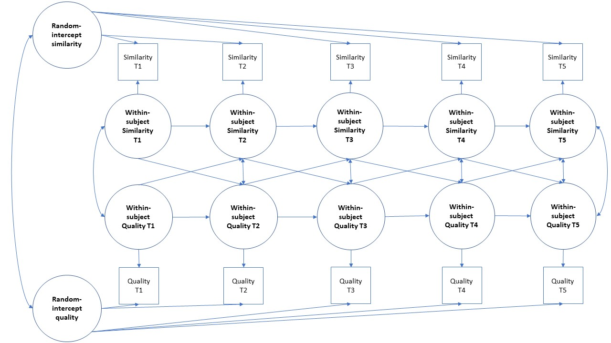
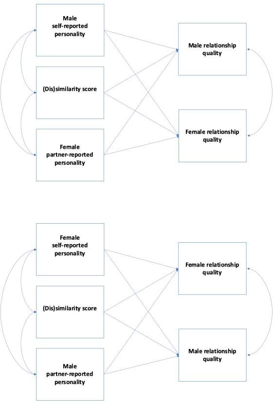

```{r setup, include=FALSE}
knitr::opts_chunk$set(echo = TRUE, warning = FALSE, message = FALSE)
```

```{r libraries, warning=FALSE, message=FALSE}
library(here)        # for file directory
library(tidyr)       # for pivot_wider
library(rio)         # to load in data
library(dplyr)       # general wrangling
library(Hmisc)       # correlation matrix
library(psych)       # fisher's z transformation
library(lme4)        # linear mixed model   
library(lmerTest)    # linear mixed model significance test
library(lavaan)      # RI-CLPM
library(semPlot)     # semPaths
library(kableExtra)  # for styling and scroll_box

# source the helper file
source("00_helpers.R")

options(digits = 3)
```

# Meta Data

This is the analytic report for the Early Dating dataset.

- Online access: This analytic report is published on [RPubs](https://rpubs.com/nguyenllpsych/diss-03-results-yw).
- Preregistration document: [RPubs](https://rpubs.com/nguyenllpsych/diss-03-prereg).
- Descriptives and exploratory data analysis on the Early Dating analytic dataset: [RPubs](https://rpubs.com/nguyenllpsych/diss-03-descr-yw).


```{r dat}
# load in data
data_yw <- rio::import(paste0(here(), "/data/cleaned_data_yw.RDS"))

# example data
data_yw %>%
  arrange(couple) %>%
  head() %>% 
  knitr::kable(
    caption = "Example first 6 rows of the Early Dating dataset"
  ) %>% 
  kableExtra::kable_styling() %>%
  scroll_box(height = "300px")
```

# Missingness Analysis

```{r missing, results="asis"}
miss_analysis(ID = "couple", var = c("agreeableness_self_1", "agreeableness_self_2"), 
              var_demo = c(
                paste0(rep(c("ethnic_black_", "ethnic_asian_", "ethnic_white_", 
                             "ethnic_hisp_", "ethnic_other_"), each = 2), 
                       rep(c(1,2), times = 5)),
                "age_1", "age_2",
                "duration_1", "duration_2",
                paste0(rep(c("agreeableness_self_", "conscientiousness_self_", 
                             "extraversion_self_", "neuroticism_self_", "openness_self_"), 
                           each = 2),
                       rep(c(1,2), times = 5))
              ),
              var_rela = c("prqc_overall_1", "prqc_overall_2"), 
              data = data_yw)
```

# Research Question 1. Evidence of Assortative Mating

## H1. Baseline similarity

#### At baseline, romantic partners are similar in their personality such that their scale scores are significantly and positively correlated

```{r H1, results="asis"}
var_list <- c(
  # traits
  paste0(
    c("neuroticism", "agreeableness", "conscientiousness", "extraversion", "openness"),
    "_self"),
  
  # CA
  "avoidance", "anxiety", "resp", "trust"
)

prof_list <- data.frame(
  bigfive = paste0(
    c("neuroticism", "agreeableness", "conscientiousness", "extraversion", "openness"),
    "_self")
)

# run function for h1
h1_results <- h1_function(var_list = var_list, prof_list = prof_list, 
                          df = data_yw[which(data_yw$time == 0),], time = 0)

# results
h1_results$bivariate %>% 
  knitr::kable(caption = "Bivariate between-partner correlation") %>% 
  kableExtra::kable_styling() %>%
  scroll_box(height = "300px")

h1_results$profile %>% 
  knitr::kable(caption = "Proportion of signficant between-partner profile correlations in traits") %>% 
  kableExtra::kable_styling()

data_yw <- merge(data_yw, h1_results$profile_df, all = TRUE)

summary(data_yw %>%
          filter(time == 0) %>%
          select(starts_with("bigfive"))) %>% 
  knitr::kable(caption = "Descriptive summary of trait profile correlations at baseline") %>% 
  kableExtra::kable_styling()
```

## H2. Difference in correlations

#### At baseline, romantic partners are more similar in their characteristic adaptations than in their personality traits.

```{r H2}
# run function on simulated data
h2_function(cor_tab = h1_results$bivariate) %>% 
  arrange(desc(abs(z_stat))) %>%
  knitr::kable(caption = "Comparisons of bivariate correlations of personality traits vs CAs") %>% 
  kableExtra::kable_styling() %>%
  scroll_box(height = "300px")
```

## H3. Longitudinal similarity

#### Longitudinally, romantic partners show a similar change trajectory in self-reported personality across the first two years of parenthood such that their slopes are significantly and positively correlated.

```{r H3}
var_list <- c(
  paste0(
    c("neuroticism", "agreeableness", "conscientiousness", "extraversion", "openness"),
    "_self"),
  "avoidance", "anxiety", "resp", "trust"
)

# longitudinal data to only include full data
data_yw_full <- table(data_yw$couple)[table(data_yw$couple) == 3] %>% names()
data_yw_full <- data_yw %>%
  filter(couple %in% data_yw_full)

# run function
h3_results <- h3_function(var_list = var_list, baseline = 0, df = data_yw_full)

# view longitudinal trends
h3_results$slopes_tab %>% 
  knitr::kable(caption = "Longitudinal trends in personality variables") %>% 
  kableExtra::kable_styling() %>%
  scroll_box(height = "300px")

# view longitudinal similarity 
h3_results$cor_tab %>% 
  knitr::kable(caption = "Bivariate between-partner slope correlations") %>% 
  kableExtra::kable_styling() %>%
  scroll_box(height = "300px")

# store slopes for later analyses in main dataframe
data_yw <- merge(data_yw, h3_results$slope_df, all.x = TRUE)
data_yw_full <- merge(data_yw_full, h3_results$slope_df, all.x = TRUE)
```

# Research Question 2. Benefit of Assortative Mating

## H4. Baseline benefit

#### At baseline, partner similarity in self-reported personality is associated with enhanced relationship quality.

```{r H4}
var_list <- c(
  # traits
  paste0(
    c("neuroticism", "agreeableness", "conscientiousness", "extraversion", "openness"),
    "_self"),
  # CA
  "avoidance", "anxiety", "resp", "trust"
)

prof_list <- c("bigfive")

quality_list <- c(
  paste0("prqc_", 
         c("overall", "satisfaction", "commitment", 
           "intimacy", "trust", "passion", "love")))

# run function
h4_results <- h4_function(var_list = var_list, 
                          quality_list = quality_list, 
                          prof_list = prof_list,
                          time = 0,
                          df = data_yw)

h4_results$interaction_tab %>% 
  knitr::kable(
    caption = "Multiple regression results with interaction terms predicting relationship quality"
  ) %>% 
  kableExtra::kable_styling() %>%
  scroll_box(height = "300px")
h4_results$difference_tab %>% 
  knitr::kable(
    caption = "Simple regression results with difference scores predicting relationship quality"
  ) %>% 
  kableExtra::kable_styling() %>%
  scroll_box(height = "300px")
h4_results$profile_tab %>% 
  knitr::kable(
    caption = "Simple regression results with profile correlations predicting relationship quality"
  ) %>% 
  kableExtra::kable_styling()
```

## H5. Baseline benefit with longitudinal predictors

#### Longitudinally, partner similarity in change trajectories of self-reported personality is associated with enhanced relationship quality at baseline.

```{r H5}
var_list <- c(
  # traits
  paste0(
    c("neuroticism", "agreeableness", "conscientiousness", "extraversion", "openness"),
    "_self"),
  # CA
  "avoidance", "anxiety", "resp", "trust"
)

quality_list <- c(
  paste0("prqc_", 
         c("overall", "satisfaction", "commitment", 
           "intimacy", "trust", "passion", "love")))

# run function
h5_results <- h5_function(var_list = var_list, 
                          quality_list = quality_list, 
                          time = 0,
                          df = data_yw) 
h5_results$interaction_tab %>% 
  knitr::kable(
    caption = "Longitudinal predictors: Multiple regression results with interaction terms of predicting relationship quality"
  ) %>% 
  kableExtra::kable_styling() %>%
  scroll_box(height = "300px")
h5_results$difference_tab %>% 
  knitr::kable(
    caption = "Longitudinal predictors: Simple regression results with difference-slope scores predicting relationship quality"
  ) %>% 
  kableExtra::kable_styling() %>%
  scroll_box(height = "300px")
```

## H6. Longitudinal benefit

#### Longitudinally, partner similarity in change trajectories of self-reported personality is associated with an increase in relationship quality

```{r H6}
var_list <- c(
  # traits
  paste0(
    c("neuroticism", "agreeableness", "conscientiousness", "extraversion", "openness"),
    "_self"),
  # CA
  "avoidance", "anxiety", "resp", "trust"
)

quality_list <- c(
  paste0("prqc_", 
         c("overall", "satisfaction", "commitment", 
           "intimacy", "trust", "passion", "love")))

# run function
h6_results <- h6_function(var_list = var_list, 
                          quality_list = quality_list, 
                          baseline = 0,
                          df = data_yw_full) 
h6_results$interaction_tab %>% 
  knitr::kable(
    caption = "Longitudinal predictors: Multiple regression results with interaction terms predicting longitudinal relationship quality"
  ) %>% kableExtra::kable_styling() %>%
  scroll_box(height = "300px")
h6_results$difference_tab %>% 
  knitr::kable(
    caption = "Longitudinal predictors: Simple regression results with difference scores predicting longitudinal relationship quality"
  ) %>% kableExtra::kable_styling() %>%
  scroll_box(height = "300px")
```

## H7. Cross-lagged effects

#### Longitudinally, there may be cross-lagged effects such that partner similarity in personality at each time point is associated with relationship quality at a subsequent time point, and vice versa. This is an exploratory analysis with no hypothesized direction.



Many of these models either did not converge or had estimation warnings.

```{r H7, eval = F}
#TODO: many did not converge or had estimation warnings
# create a cross-lagged dataset from timepoints 1->3 instead of 0->16
data_riclpm <- data_yw %>%
  mutate(time = case_when(
    time == 0 ~ 1,
    time == 8 ~ 2,
    time == 16 ~ 3)
)
var_list <- c(
  # traits
  paste0(
    c("neuroticism", "agreeableness", "conscientiousness", "extraversion", "openness"),
    "_self"),
  # CA
  "avoidance", "anxiety", "resp", "trust"
)

prof_list <- c("bigfive")

quality_list <- c(
  paste0("prqc_", 
         c("overall", "satisfaction", "commitment", 
           "intimacy", "trust", "passion", "love")))

# run function 
h7_results <- h7_function(var_list = var_list, prof_list = prof_list,
                          quality_list = quality_list, df = data_riclpm)
h7_results$fit_df %>%
  knitr::kable(
    caption = "Fit statistics for models of univariate personality difference") %>%
  kableExtra::kable_styling() %>%
  scroll_box(height = "300px")

h7_results$est_df %>%
  knitr::kable(
    caption = "Standardized solutions for models of univariate personality difference") %>%
  kableExtra::kable_styling() %>%
  scroll_box(height = "300px")

h7_results$fitprof_df %>%
  knitr::kable(
    caption = "Fit statistics for models of personality profile correlation") %>%
  kableExtra::kable_styling() %>%
  scroll_box(height = "300px")

h7_results$estprof_df %>%
  knitr::kable(
    caption = "Standardized solutions for models of personality profile correlation") %>%
  kableExtra::kable_styling() %>%
  scroll_box(height = "300px")
```


# Research Question 3. Actor/Partner/Perceived/Similarity

## H8. Actor/partner effect on quality

#### At baseline, self-reported characteristic adaptations are most strongly associated with self-reported relationship quality, more so than the effect of partner-reported and similarity on these variables.


```{r H8}
var_list <- c(
  # traits
  paste0(
    c("neuroticism", "agreeableness", "conscientiousness", "extraversion", "openness"),
    "_self"),
  # CA
  "avoidance", "anxiety", "resp", "trust"
)

quality_list <- c(
  paste0("prqc_", 
         c("overall", "satisfaction", "commitment", 
           "intimacy", "trust", "passion", "love")))

# run function
h8_results <- h8_function(var_list = var_list,
                          quality_list = quality_list,
                          time = 0, df = data_yw)
h8_results %>%
  knitr::kable(
    caption = "Standardized solutions for APIM models with actual similarity"
  ) %>%
  kableExtra::kable_styling() %>%
  scroll_box(height = "300px")
```


## H9. Perceived/actual similarity comparison 

#### At baseline, perceived similarity in personality traits and characteristic adaptations is stronger than actual similarity. That is, the correlation between each partner’s self-perception and perception of their partner is stronger than the correlation between two partners’ self-perceptions.

```{r h9}
perception_list <- c("neuroticism", "agreeableness", "conscientiousness", "extraversion", "openness")

# run function
h9_results <- h9_function(perception_list = perception_list,
                          time = 0, df = data_yw)

h9_results$similarity_df %>%
  knitr::kable(
    caption = "Actual and perceived similarities as bivariate correlations") %>%
  kableExtra::kable_styling() %>%
  scroll_box(height = "300px")

h9_results$compare_df %>%
  knitr::kable(
    caption = "Comparison between actual and perceived similarities") %>%
  kableExtra::kable_styling() %>%
  scroll_box(height = "300px")
```

## H10. Perceived/actual similarity effects

#### At baseline, each partner’s perceived similarity is more strongly associated with self-reported relationship quality than actual similarity is.



```{r h10}
perception_list <- c("neuroticism", "agreeableness", "conscientiousness", "extraversion", "openness")

quality_list <- c(
  paste0("prqc_", 
         c("overall", "satisfaction", "commitment", 
           "intimacy", "trust", "passion", "love")))

# run function
h10_results <- h10_function(perception_list = perception_list,
                            quality_list = quality_list,
                            timepoint = 0, df = data_yw)

h10_results$est_df_p1 %>%
  knitr::kable(
    caption = "Standardized solutions for APIM models with female-perceived similarity"
  ) %>%
  kableExtra::kable_styling() %>%
  scroll_box(height = "300px")
h10_results$est_df_p2 %>%
  knitr::kable(
    caption = "Standardized solutions for APIM models with male-perceived similarity"
  ) %>%
  kableExtra::kable_styling() %>%
  scroll_box(height = "300px")
```


